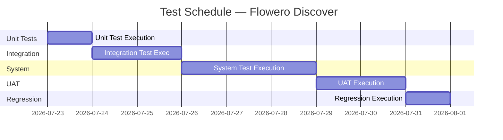

# Test Plan

> **Project:** Flowero Discover
> **Version:** 0.1 | **Status:** Draft
> **Last Updated:** 2026-07-26

---

## Document Control

| Field | Value |
|-------|-------|
| Document Owner | QA Engineer |
| Approvals | PM, Tech Lead, QA Lead |

### Approvals

| Role | Name | Signature | Date |
|------|------|-----------|------|
| Project Manager | PO Persona | | |
| Technical Lead | Dev Persona | | |
| QA Lead | QA Engineer | | |

---

## 1. Introduction

### 1.1 Purpose

> This plan defines the testing approach, scope, resources, schedule, and deliverables for Flowero Discover — the Spring Cloud Netflix Eureka service registry for the Panomete Platform.

### 1.2 Scope

| In Scope | Out of Scope |
|---------|-------------|
| Eureka server startup and configuration verification | Performance/load testing — separate plan |
| Service registration (POST /eureka/apps/{name}) | Security testing — see 061_security_test_report |
| Service discovery (GET /eureka/apps, GET /eureka/apps/{name}) | Disaster recovery testing |
| Heartbeat and lease renewal (PUT /eureka/apps/{name}/{instance}) | Multi-node clustering (standalone only) |
| Service deregistration (DELETE /eureka/apps/{name}/{instance}) | Nginx proxy configuration testing |
| Actuator health endpoint (/actuator/health) | |
| Dashboard accessibility (/) | |
| Self-preservation mode behavior | |
| Docker container health and restart | |
| Integration with Gate (lb:// resolution) | |
| Regression testing | |

## 2. Test Strategy

| Level | Type | Automation | Coverage Target |
|-------|------|-----------|----------------|
| Unit | White-box | 100% | ≥ 80% code coverage — `FlowerodiscoveryApplicationTests` |
| Integration | Gray-box | 80% | All Eureka REST API endpoints (`/eureka/apps`, `/actuator/health`, `/`) |
| System | Black-box | 60% | All user stories (US-101 through US-104) |
| UAT | Black-box | 0% | Dashboard accessible at `discovery.panomete.com` via Nginx |
| Regression | Black-box | 100% | All critical paths — standalone mode, registration, discovery, health |

### Test Approach

Flowero Discover is a **minimal service** — a single `@SpringBootApplication` + `@EnableEurekaServer` class with YAML configuration. Testing focuses on:

1. **Spring context startup** — Eureka server initializes correctly
2. **REST API correctness** — Registration, discovery, heartbeat, deregistration endpoints
3. **Standalone mode** — No self-registration, no peer replication
4. **Operational readiness** — Health endpoint, dashboard, Docker healthcheck
5. **Configuration correctness** — Self-preservation, eviction timers, renewal thresholds

## 3. Test Environment

| Environment | Purpose | URL | Data |
|------------|---------|-----|------|
| Development | Developer testing via `./gradlew bootRun` | `http://localhost:8999` | Synthetic registrations |
| Docker Local | Container validation via `docker compose up` | `http://localhost:8999`, `http://localhost:3999` | Synthetic |
| Homelab (Staging) | Pre-production testing via Nginx | `https://discovery.panomete.com` | Real platform services |

### Test Infrastructure

| Component | Technology | Purpose |
|-----------|-----------|---------|
| JUnit 5 | JUnit Platform + AssertJ | Test framework |
| RestTemplate | Plain HTTP client | API integration tests |
| SpringBootTest | `RANDOM_PORT` web environment | Embedded server for integration tests |
| Docker Compose | `docker-compose.fragment.yml` | Container-level testing |
| Gradle | `./gradlew test` | Test execution and reporting |

## 4. Test Schedule

## 5. Test Resources

| Role | Name | Responsibility |
|------|------|---------------|
| QA Lead | QA Engineer | Test planning, test case design, defect triage |
| QA Engineer 1 | QA Engineer | System testing, integration test automation |
| Dev Persona | Dev Persona | Fix defects, provide test environment |
| PO Persona | PO Persona | UAT sign-off, acceptance criteria validation |

## 6. Entry & Exit Criteria

| Phase | Entry Criteria | Exit Criteria |
|-------|---------------|--------------|
| Unit | `FlowerodiscoveryApplication.java` compiles, PR merged | ≥ 80% coverage, all 6 tests pass |
| Integration | Unit tests pass, Eureka server starts on :8999 | All REST API endpoints verified (register, discover, heartbeat, deregister) |
| System | Integration tests pass, Docker image builds | All 🔴 Must Have acceptance criteria verified (11 of 16) |
| UAT | System tests pass, Nginx proxy configured | Stakeholder sign-off on dashboard at `discovery.panomete.com` |
| Regression | All defects fixed | No critical/high defects, all critical path tests pass |

## 7. Defect Management

| Severity | Response Time | Resolution Time | Escalation |
|---------|-------------|----------------|-----------|
| Critical | 1 hour | 4 hours | PM + Tech Lead |
| High | 4 hours | 1 day | Tech Lead |
| Medium | 1 day | 3 days | — |
| Low | 3 days | Next sprint | — |

## 8. Risk & Mitigations

| Risk | Probability | Impact | Mitigation |
|------|-----------|--------|-----------|
| Eureka server slow to start in test environment | Medium | Medium | Use `@SpringBootTest(webEnvironment = RANDOM_PORT)` with adequate timeout; `wait-time-in-ms-when-sync-empty: 0` |
| Spring Cloud 2025.1.2 BOM version incompatibility | Low | High | Pin BOM version in `build.gradle`; regression test on BOM updates |
| Self-preservation mode prevents eviction testing | Medium | Medium | Document behavior; test with `enable-self-preservation: false` in test profile |
| Docker port conflict on homelab | Low | Medium | Pre-deployment check: `ss -tlnp \| grep -E '8999\|3999'` |
| Nginx proxy misconfiguration blocks dashboard | Medium | High | Separate port testing — internal (8999) vs external (3999 via Nginx) |

---

## Related Documents

| Document | Relationship |
|----------|-------------|
| [[042_test_cases]] | Detailed test cases derived from this plan |
| [[043_defect_report]] | Defects found during test execution |
| [[044_regression_test_suite]] | Regression suite for ongoing testing |
| [[045_coverage_report]] | Code and requirements coverage metrics |
| [[013_acceptance_criteria]] | 16 BDD acceptance criteria being verified |
| [[061_security_test_report]] | Security testing results |

---

> **Template Standard:** Based on SWEBOK v4, ISO/IEC/IEEE 29119
> **Usage:** The test plan is the *contract* for testing. Everyone knows what's tested, when, and by whom.
