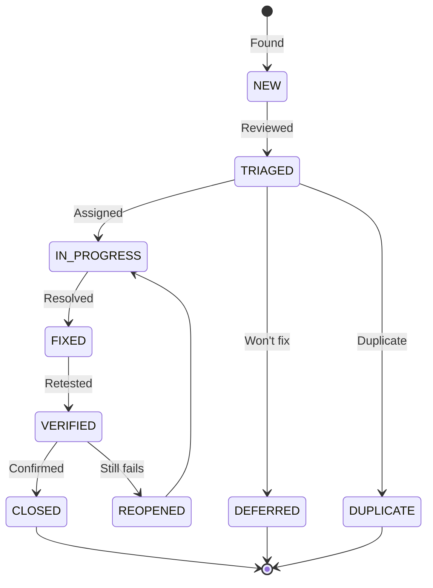

# Defect Report

> **Project:** Flowero Discover
> **Version:** 0.1 | **Status:** Draft
> **Last Updated:** 2026-07-26

---

## 1. Purpose

> Standardized defect reporting for Flowero Discover — capturing all information needed to reproduce, fix, and verify defects found during code review and test execution.

## 2. Defect Lifecycle



## 3. Defect Template

| Field | Value |
|-------|-------|
| **Defect ID** | DEF-008 |
| **Title** | Brief, descriptive title |
| **Severity** | 🔴 Critical / 🟡 High / 🟢 Medium / ⚪ Low |
| **Priority** | 🔴 P1 / 🟡 P2 / 🟢 P3 / ⚪ P4 |
| **Status** | New / Triaged / In Progress / Fixed / Verified / Closed |
| **Module** | Registration / Discovery / Dashboard / Configuration / Container |
| **Reported By** | QA Engineer |
| **Assigned To** | Dev Persona |
| **Reported Date** | 2026-07-26 |
| **Target Fix** | Sprint X |
| **Test Case** | TC-XXX |
| **Requirement** | US-XXX / AC-DXXX |

## 4. Defect Register

| ID | Title | Severity | Module | Status | Assigned | Reported | Fixed |
|----|-------|---------|--------|--------|---------|---------|-------|
| DEF-001 | TestRestTemplate not available in Boot 4.1 test scope | 🟢 Medium | Testing | ✅ Closed | Dev Persona | Jul 23 | Jul 23 |
| DEF-002 | doesNotRegisterWithItself() checks wrong app name | 🟢 Medium | Testing | ✅ Closed | Dev Persona | Jul 23 | Jul 23 |
| DEF-003 | No automated linting or static analysis configured | 🟡 High | Build | ⬜ New | — | Jul 26 | — |
| DEF-004 | OWASP Dependency-Check not configured in build pipeline | 🟡 High | Security | ⬜ New | — | Jul 26 | — |
| DEF-005 | Dual-port design (8999/3999) may not be feasible with single Eureka instance | 🟡 High | Configuration | 🔄 In Progress | Dev Persona | Jul 26 | — |
| DEF-006 | No test coverage for self-preservation mode behavior | 🟢 Medium | Testing | ⬜ New | — | Jul 26 | — |
| DEF-007 | Actuator health show-details: always exposes internals on unauthenticated endpoint | 🟢 Medium | Security | ⬜ New | — | Jul 26 | — |

## 5. Defect Details

### DEF-001: TestRestTemplate Not Available in Boot 4.1 Test Scope

| Field | Detail |
|-------|--------|
| **ID** | DEF-001 |
| **Severity** | 🟢 Medium |
| **Priority** | 🟡 P2 |
| **Status** | ✅ Closed |
| **Module** | Testing |
| **Reported By** | Dev Persona |
| **Assigned To** | Dev Persona |
| **Reported Date** | 2026-07-23 |
| **Target Fix** | Sprint M1 |
| **Test Case** | TC-003, TC-004, TC-010, TC-011 |
| **Requirement** | US-101, US-103 |

#### Description

> `TestRestTemplate` from `spring-boot-starter-test` does not resolve correctly in Spring Boot 4.1.0 test scope for the Eureka Server application. The import fails to compile when used in `FlowerodiscoveryApplicationTests`.

#### Steps to Reproduce

| Step | Action | Expected Result | Actual Result |
|------|--------|----------------|--------------|
| 1 | Add `import org.springframework.boot.test.web.client.TestRestTemplate` | Import resolves | Import unresolved — class not found in test classpath |
| 2 | Attempt to autowire `TestRestTemplate` | Bean available for injection | No qualifying bean of type `TestRestTemplate` |

#### Environment

| Field | Value |
|-------|-------|
| Framework | Spring Boot 4.1.0 |
| Cloud | Spring Cloud 2025.1.2 |
| Java | 25 (Eclipse Temurin) |
| Build | Gradle 9.5.1 |

#### Evidence

| Type | Description |
|------|-----------|
| Compilation Error | `TestRestTemplate` import does not resolve |
| Root Cause | Eureka Server starter provides embedded Tomcat; `TestRestTemplate` requires `spring-boot-starter-web` in test scope, which conflicts with Eureka's server starter |

#### Resolution

> Replaced `TestRestTemplate` with plain `RestTemplate` instantiated in `@BeforeEach`. Uses `@LocalServerPort` to construct URLs dynamically. All 6 tests pass with this approach.

---

### DEF-002: doesNotRegisterWithItself() Checks Wrong App Name

| Field | Detail |
|-------|--------|
| **ID** | DEF-002 |
| **Severity** | 🟢 Medium |
| **Priority** | 🟡 P2 |
| **Status** | ✅ Closed |
| **Module** | Testing |
| **Reported By** | Dev Persona |
| **Assigned To** | Dev Persona |
| **Reported Date** | 2026-07-23 |
| **Target Fix** | Sprint M1 |
| **Test Case** | TC-002 |
| **Requirement** | US-101 / AC-D101d |

#### Description

> The `doesNotRegisterWithItself()` test initially checked for the wrong application name. Eureka uppercases `spring.application.name` and preserves hyphens: `flowero-discover` becomes `FLOWERO-DISCOVER`, not `FLOWERODISCOVERY`.

#### Steps to Reproduce

| Step | Action | Expected Result | Actual Result |
|------|--------|----------------|--------------|
| 1 | Check response for `FLOWERODISCOVERY` | Not found | Test passes trivially (wrong name) |
| 2 | Check response for `FLOWERO-DISCOVER` | Not found (standalone mode) | Correct assertion |

#### Resolution

> Updated assertion to `doesNotContain("FLOWERO-DISCOVER")`. This correctly verifies standalone mode — Eureka does not self-register.

---

### DEF-003: No Automated Linting or Static Analysis

| Field | Detail |
|-------|--------|
| **ID** | DEF-003 |
| **Severity** | 🟡 High |
| **Priority** | 🟡 P2 |
| **Status** | ⬜ New |
| **Module** | Build |
| **Reported By** | QA Engineer |
| **Assigned To** | — |
| **Reported Date** | 2026-07-26 |
| **Target Fix** | Sprint M3 |
| **Requirement** | 035_coding_standards_development §6 |

#### Description

> `build.gradle` has no Checkstyle, Spotless, SpotBugs, or OWASP Dependency-Check plugins configured. The coding standards document (§6) acknowledges this gap and recommends adding these tools. CI pipeline references `./gradlew checkstyleMain` but the task does not exist.

#### Steps to Reproduce

| Step | Action | Expected Result | Actual Result |
|------|--------|----------------|--------------|
| 1 | Run `./gradlew checkstyleMain` | Code style violations reported | Task not found — plugin not applied |
| 2 | Run `./gradlew spotbugsMain` | Static analysis results | Task not found |
| 3 | Run `./gradlew dependencyCheckAnalyze` | Vulnerability report | Task not found |

#### Impact

> Code style is not enforced automatically. Manual code review is the only quality gate. Risk of style drift when multiple contributors join.

#### Remediation

> Add to `build.gradle`:
> - `com.diffplug.spotless` plugin with Google Java Format
> - `com.github.spotbugs` plugin
> - `org.owasp.dependencycheck` plugin
> Integrate into CI pipeline after configuration.

---

### DEF-004: OWASP Dependency-Check Not Configured

| Field | Detail |
|-------|--------|
| **ID** | DEF-004 |
| **Severity** | 🟡 High |
| **Priority** | 🟡 P2 |
| **Status** | ⬜ New |
| **Module** | Security |
| **Reported By** | QA Engineer |
| **Assigned To** | — |
| **Reported Date** | 2026-07-26 |
| **Target Fix** | Sprint M3 |
| **Requirement** | 033_dependency_manifest §7 |

#### Description

> The dependency manifest (§7 Vulnerability Status) explicitly states "OWASP Dependency-Check not yet configured" and recommends adding the `org.owasp.dependencycheck` Gradle plugin. The ~40 transitive dependencies (managed by Spring Cloud BOM 2025.1.2) have never been scanned for known CVEs.

#### Impact

> Unknown vulnerabilities may exist in transitive dependencies (e.g., `xstream`, `jersey-client`, `jackson-databind`). Without automated scanning, CVEs are only discovered reactively.

#### Remediation

> Add to `build.gradle`:
> ```groovy
> plugins {
>     id 'org.owasp.dependencycheck' version '10.0.4'
> }
> ```
> Add to CI pipeline as a quality gate step.

---

### DEF-005: Dual-Port Design Feasibility Concern

| Field | Detail |
|-------|--------|
| **ID** | DEF-005 |
| **Severity** | 🟡 High |
| **Priority** | 🔴 P1 |
| **Status** | 🔄 In Progress |
| **Module** | Configuration |
| **Reported By** | QA Engineer |
| **Assigned To** | Dev Persona |
| **Reported Date** | 2026-07-26 |
| **Target Fix** | Sprint M1 |
| **Requirement** | ADR-D005 / US-104 |

#### Description

> ADR-D005 specifies dual ports: 8999 (REST API) and 3999 (Dashboard). However, standard Eureka serves both API and dashboard on the same port. The current `application.yaml` only configures `server.port: 8999`. The Dockerfile exposes both ports but maps 3999:8999 (same internal port). There is no separate embedded server for the dashboard.

> The deployment plan (§4, Note) acknowledges: "If this proves infeasible during Sprint 1 (US-101), fall back to single-port."

#### Steps to Reproduce

| Step | Action | Expected Result | Actual Result |
|------|--------|----------------|--------------|
| 1 | Start Eureka with `server.port: 8999` | Dashboard and API both on :8999 | Confirmed — single port |
| 2 | Docker maps `3999:8999` | Dashboard accessible on host :3999 | Works (same Eureka, different host port) |
| 3 | Nginx proxies to :3999 | Dashboard loads | Works via port remapping |

#### Impact

> The design works via Docker port mapping (host 3999 → container 8999), but internally there is no port separation. The API is also accessible through the "dashboard" port. This may need Nginx path-based filtering if API access should be restricted on the dashboard port.

#### Remediation

> Option A: Accept single-port design, update ADR-D005.
> Option B: Add a second embedded Tomcat server for dashboard-only access.
> Option C: Use Nginx path-based filtering to restrict API access on :3999.

---

### DEF-006: No Test Coverage for Self-Preservation Mode

| Field | Detail |
|-------|--------|
| **ID** | DEF-006 |
| **Severity** | 🟢 Medium |
| **Priority** | 🟢 P3 |
| **Status** | ⬜ New |
| **Module** | Testing |
| **Reported By** | QA Engineer |
| **Assigned To** | — |
| **Reported Date** | 2026-07-26 |
| **Target Fix** | Sprint M2 |
| **Requirement** | ADR-D004 / AC-D102d |

#### Description

> Self-preservation mode (`eureka.server.enable-self-preservation: true`) is a critical configuration (ADR-D004) that prevents eviction during network partitions. However, no test verifies:
> - Self-preservation activates when heartbeat renewal drops below 85%
> - Stale instances are preserved (not evicted) during self-preservation
> - Self-preservation deactivates when heartbeats resume

#### Impact

> The eviction test (TC-016) may not work correctly if self-preservation activates during the test window, preventing eviction and causing a false failure.

#### Remediation

> Add integration test with `@TestPropertySource` that sets `enable-self-preservation: false` for eviction testing. Add separate test that verifies self-preservation behavior.

---

### DEF-007: Actuator Health Show-Details Exposes Internals

| Field | Detail |
|-------|--------|
| **ID** | DEF-007 |
| **Severity** | 🟢 Medium |
| **Priority** | 🟢 P3 |
| **Status** | ⬜ New |
| **Module** | Security |
| **Reported By** | QA Engineer |
| **Assigned To** | — |
| **Reported Date** | 2026-07-26 |
| **Target Fix** | Sprint M3 |
| **Requirement** | Security Best Practice |

#### Description

> `application.yaml` sets `management.endpoint.health.show-details: always`, which exposes full health component details (disk space, Eureka internals, JVM info) on the unauthenticated `/actuator/health` endpoint. While the service runs on a trusted Docker network, this is overly permissive if the endpoint becomes exposed.

#### Steps to Reproduce

| Step | Action | Expected Result | Actual Result |
|------|--------|----------------|--------------|
| 1 | `curl http://localhost:8999/actuator/health` | Basic `{"status":"UP"}` | Full details: disk space, Eureka server components, JVM info |

#### Impact

> Information disclosure — internal health details visible to anyone who can reach the endpoint. Low risk on trusted Docker network, but violates defense-in-depth.

#### Remediation

> Change to `show-details: when-authorized` and add Spring Security, or accept the risk with documentation noting the trusted network assumption.

---

## 6. Defect Metrics

| Metric | Value | Target | Status |
|--------|-------|--------|--------|
| Total defects found | 7 | — | — |
| Critical defects | 0 | 0 at release | 🟢 |
| High defects | 3 | 0 at release | 🟡 |
| Defects fixed | 2 | — | — |
| Defects remaining | 5 | < 3 | 🟡 |
| Avg fix time — Critical | N/A | < 24h | 🟢 |
| Avg fix time — Medium | Same session | < 3 days | 🟢 |
| Defect density | 7 / 1 class + config | < 5 | 🟡 |
| Defect reopen rate | 0% | < 10% | 🟢 |

## 7. Severity Definitions

| Severity | Definition | Response | Resolution |
|---------|-----------|---------|-----------|
| 🔴 **Critical** | Eureka server fails to start, registry corruption, all services unresolvable | 1 hour | 4 hours |
| 🟡 **High** | Major feature broken (registration/discovery fails), security gap, no workaround | 4 hours | 1 day |
| 🟢 **Medium** | Feature partially broken, workaround exists, test gap | 1 day | 3 days |
| ⚪ **Low** | Minor issue, cosmetic, documentation | 3 days | Next sprint |

---

## Related Documents

| Document | Relationship |
|----------|-------------|
| [[042_test_cases]] | Tests that found defects |
| [[036_code_review_records]] | Code review findings (DEF-001, DEF-002 originated here) |
| [[035_coding_standards_development]] | Standards that DEF-003 addresses |
| [[033_dependency_manifest]] | Dependency gaps (DEF-004) |
| [[061_security_test_report]] | Security findings (DEF-004, DEF-007) |

---

> **Template Standard:** Based on SWEBOK v4, ISO/IEC/IEEE 29119
> **Usage:** A good defect report is *reproducible*. If the developer can't reproduce it, they can't fix it. Steps, environment, evidence.
